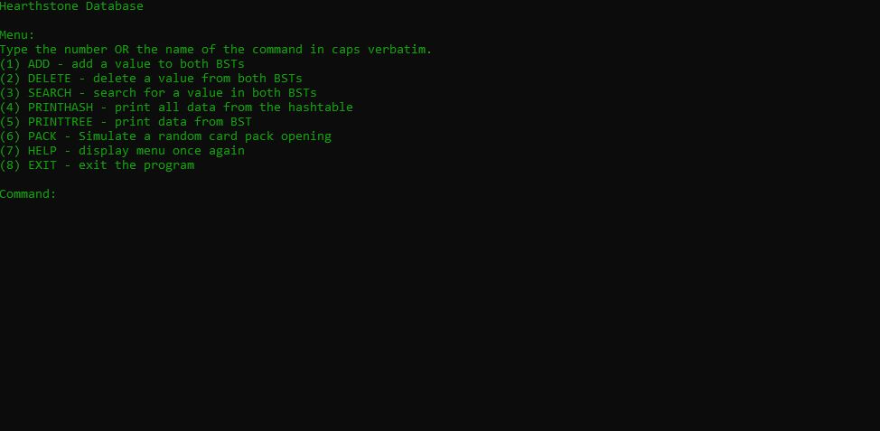

# FinalProj22C
This repository is for our CIS 22C Final Project, a command line Hearthstone Card Database. It allows user to view, sort, and compare Hearthstone cards. You can also simulate a random pack opening from the game.
We used Linked Lists, Binary Search Trees, and Hash Tables.

